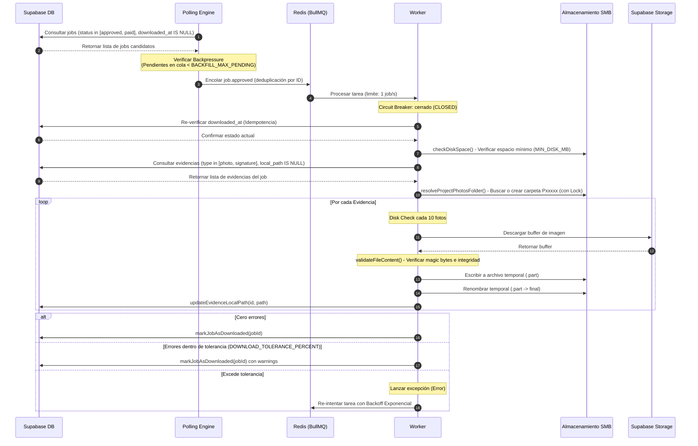
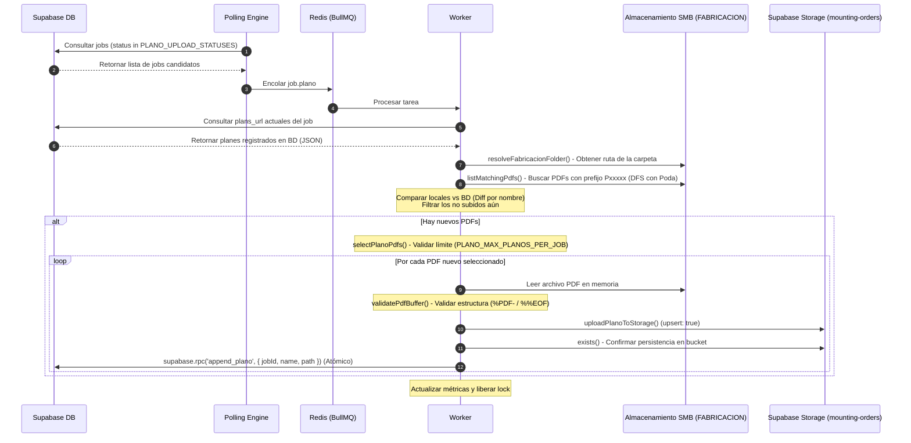
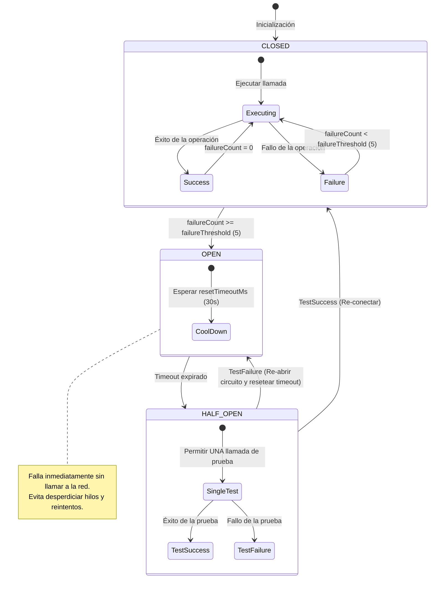
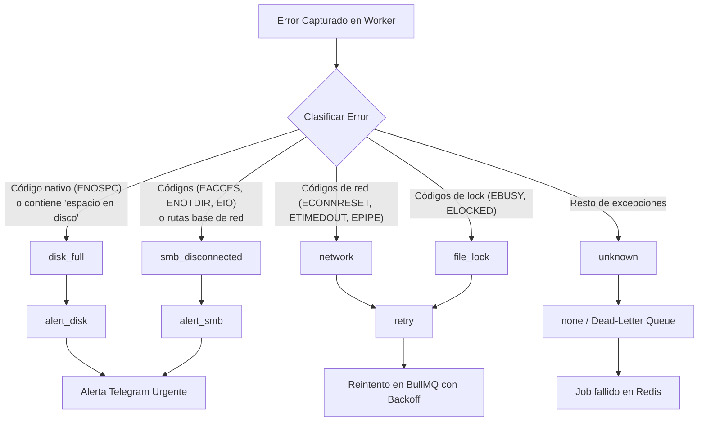
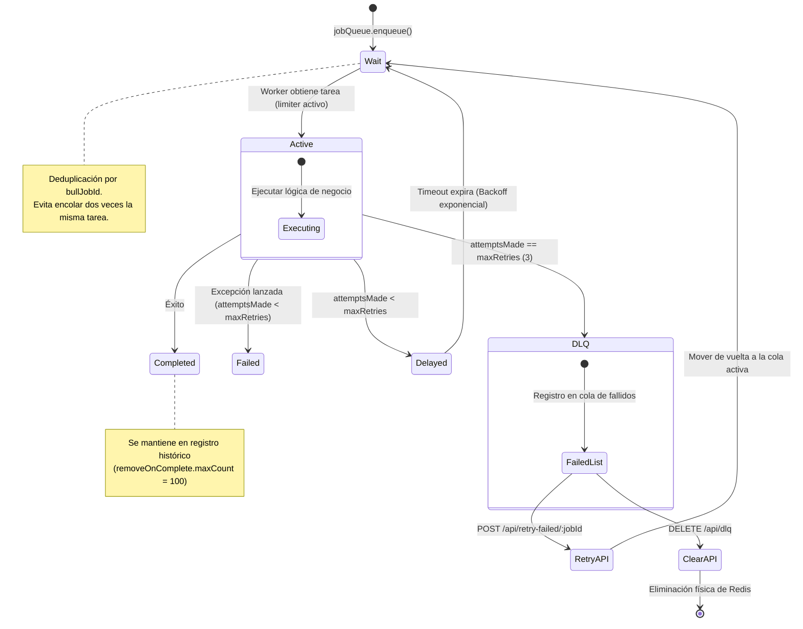

# Especificación de Arquitectura de Software

Este documento proporciona una descripción detallada de la arquitectura técnica, los flujos de datos, los mecanismos de tolerancia a fallos y los patrones de diseño utilizados en el middleware **Incorutas Photo Sync**.

---

## 1. Vista General de Componentes

El sistema está diseñado bajo un modelo de arquitectura desacoplada orientada a tareas mediante colas, separando la interfaz de monitorización/API y el ciclo de polling del worker de ejecución pesado.

```mermaid
graph TB
    subgraph Supabase [Nube Supabase]
        DB[(PostgreSQL)]
        EvidencesBucket[Bucket 'evidence']
        PlanosBucket[Bucket 'mounting-orders']
    end

    subgraph Local [Servidor Físico On-Premise]
        subgraph App [Middleware Node.js]
            Express[Express.js App]
            Polling[Polling Engine]
            Worker[BullMQ Worker]
        end

        subgraph Storage [Cola y Caché]
            Redis[(Redis)]
        end

        subgraph SMB [Almacenamiento Local SMB]
            Activos["1ACTIVOS/ (Trabajos Activos)"]
            Terminados["TERMINADOS/ (Trabajos Finalizados)"]
            Fabricacion["FABRICACION/ (Planos PDF)"]
        end
    end

    subgraph External [Notificaciones]
        Telegram[Telegram Bot API]
    end

    %% Relaciones
    Polling -- 1. Polling cada 30s --> DB
    Polling -- 2. Encolar Trabajo --> Redis
    Worker -- 3. Consumir Tarea --> Redis
    Worker -- 4. Descargar Evidencia --> EvidencesBucket
    Worker -- 5. Guardar Foto --> Activos
    Worker -- 6. Escanear Planos --> Fabricacion
    Worker -- 7. Subir Planos --> PlanosBucket
    Worker -- 8. Actualizar DB (RPC) --> DB
    Express -- Consultar Estado --> Redis
    Express -- Métricas /metrics --> Prometheus((Prometheus))
    Worker -. Alertas de Error .-> Telegram
    Polling -. Alertas de Error .-> Telegram
```

---

## 2. Flujo de Descarga de Fotos (`job.approved`)

Este flujo representa el ciclo completo de descarga de evidencias desde Supabase Storage hacia el montaje físico SMB en local.

---

## 3. Flujo de Subida de Planos (`job.plano`)

Este proceso detecta de manera autónoma los PDFs de fabricación locales en el servidor físico y los sube a Supabase Storage para que el cliente pueda visualizarlos en tiempo real.

---

## 4. Estado de Transición del Circuit Breaker

Para evitar la degradación del middleware por fallos repetitivos en las peticiones a la API externa de Supabase (por ejemplo, por cortes de internet), se utiliza un Circuit Breaker.

---

## 5. Matriz de Clasificación de Errores

El componente `error-classifier` interpreta los errores lanzados durante la ejecución de las colas y determina dinámicamente si se debe reintentar, alertar de inmediato a los administradores o enviar el trabajo a la Dead-Letter Queue (DLQ).

---

## 6. Pipeline y Ciclo de Vida de la Cola BullMQ

La cola distribuida en Redis organiza los ciclos de ejecución, garantizando la persistencia e idempotencia del middleware frente a reinicios bruscos de servidor.

