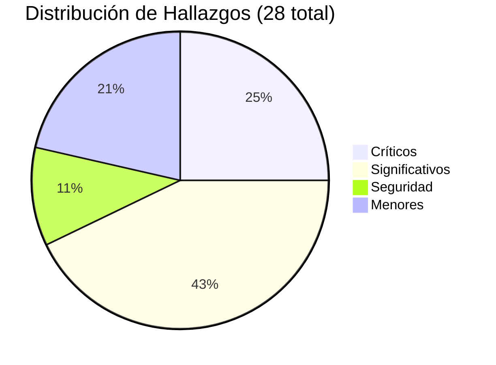

# 🔍 Auditoría de Código: Incorutas Photo Sync

Análisis exhaustivo línea por línea de los **30+ archivos fuente** del middleware. Se han identificado **28 hallazgos reales** clasificados por severidad.

---

## 🔴 Bugs Críticos (7)

Estos bugs pueden causar **pérdida de datos, bloqueos del sistema o crashes** en producción.

---

### 1. RedisLockProvider almacena el owner en la instancia — los locks se corrompen bajo concurrencia
**Archivo:** [lock.js](file:///c:/Users/marcos/test-middleware/incorutas-photo-sync/src/utils/lock.js#L73-L86)  
**Afecta a:** [downloader.js](file:///c:/Users/marcos/test-middleware/incorutas-photo-sync/src/services/downloader.js#L12-L17), [folder-mover.js](file:///c:/Users/marcos/test-middleware/incorutas-photo-sync/src/services/folder-mover.js#L10-L15)

```js
// lock.js — líneas 75-81
const ownerId = crypto.randomUUID();
const result = await this._redis.set(redisKey, ownerId, 'PX', ttlMs, 'NX');
if (result === 'OK') {
  this._ownerId = ownerId;    // ← BUG: se guarda en la instancia (singleton)
  this._lockedKey = key;       // ← BUG: se sobreescribe si otro caller adquiere un lock
```

**Problema:** `RedisLockProvider` es un **singleton**. Si dos callers adquieren locks sobre **distintas keys** (ej. dos proyectos simultáneos), el segundo `acquire()` sobreescribe `this._ownerId` del primero. Al hacer `release()` del primero, usa el ownerId **equivocado** y el lock **nunca se libera** (queda bloqueado hasta que expira el TTL).

**Impacto:** Deadlocks silenciosos. Los trabajos del proyecto bloqueado fallan con `"Lock contention"` hasta que el TTL expire (30-60s).

**Fix:** Almacenar los owners en un `Map<key, ownerId>` o devolver el `ownerId` como token al llamar a `acquire()`.

---

### 2. Condición de carrera TOCTOU en `resolveUniqueFilename` — posible sobreescritura de fotos
**Archivo:** [downloader.js](file:///c:/Users/marcos/test-middleware/incorutas-photo-sync/src/services/downloader.js#L58-L73)

```js
async function resolveUniqueFilename(targetFolder, filename) {
  for (let i = 1; i <= MAX_UNIQUE_ATTEMPTS; i++) {
    try {
      await fs.promises.access(candidate); // CHECK: ¿existe el archivo?
      candidate = path.join(targetFolder, `${base} (${i})${ext}`);
    } catch {
      return candidate; // USE: se asume que no existe, pero otro proceso pudo crearlo
    }
  }
}
```

**Problema:** Entre el momento en que `access()` confirma que el archivo no existe y el momento en que `writeFile` lo crea, otro proceso concurrente (ej. `retryFailedEvidences` ejecutándose en paralelo para el mismo proyecto) puede crear el archivo con el mismo nombre. Resultado: **una foto sobreescribe silenciosamente a otra**.

**Impacto:** Pérdida de datos fotográficos.

**Fix:** Usar `fs.open()` con flag `wx` (escritura exclusiva, falla si el archivo ya existe) en lugar de check+write separados.

---

### 3. `handleGracefulShutdown` no es idempotente — doble Ctrl+C provoca crash
**Archivo:** [shutdown.js](file:///c:/Users/marcos/test-middleware/incorutas-photo-sync/src/shutdown.js#L14-L34)

```js
// No hay guarda contra múltiples invocaciones
function handleGracefulShutdown(signal, server) {
  server.close(() => { ... });
  shutdownResources(); // Se ejecuta de nuevo con el segundo SIGINT/SIGTERM
}
```

**Problema:** Si el usuario pulsa Ctrl+C dos veces (o Docker envía SIGTERM seguido de SIGKILL), `shutdownResources()` se ejecuta dos veces. Esto llama a `connection.quit()` sobre una conexión Redis ya cerrada, lo que lanza una excepción no capturada.

**Impacto:** Crash durante el apagado controlado. Si hay un job en proceso de descarga, la foto puede quedar como `.part` corrupta.

**Fix:** Añadir un flag `let isShuttingDown = false` y hacer `if (isShuttingDown) return;` al inicio.

---

### 4. Timers de timeout no limpiados en rutas de API — `UnhandledPromiseRejection`
**Archivo:** [api.js](file:///c:/Users/marcos/test-middleware/incorutas-photo-sync/src/routes/api.js#L40-L54)

```js
// Líneas 40-42 — también en líneas 52-54 y 225-227
const timeoutPromise = new Promise((_, reject) =>
  setTimeout(() => reject(new Error('Timeout')), 5000)  // ← nunca se limpia
);
const space = await Promise.race([storageCheck, timeoutPromise]);
```

**Problema:** Cuando `storageCheck` gana la carrera, el `setTimeout` sigue activo y eventualmente dispara `reject()` sobre una Promise que ya se resolvió. Esto genera un `UnhandledPromiseRejection`. En Node.js 15+ con `--unhandled-rejections=throw`, **esto puede matar el proceso**.

**Impacto:** Crash del servidor en producción bajo ciertas versiones de Node.js.

**Fix:** Guardar el timer y limpiarlo en un `.finally()`, como ya se hace correctamente en [diagnostic.js](file:///c:/Users/marcos/test-middleware/incorutas-photo-sync/src/routes/diagnostic.js#L16-L22).

---

### 5. Conexión Redis compartida directamente con BullMQ
**Archivo:** [bull-queue.js](file:///c:/Users/marcos/test-middleware/incorutas-photo-sync/src/jobs/bull-queue.js#L22-L46)

```js
this.queue = new Queue('photo-download', { connection }); // misma instancia ioredis
this.worker = new Worker('photo-download', handler, { connection }); // misma instancia
```

**Problema:** BullMQ **reutiliza** la instancia de ioredis que se le pasa directamente (no la duplica). La `Queue` y el `Worker` comparten la misma conexión TCP. Al cerrar con `connection.quit()` en el shutdown, si uno de los dos aún tiene comandos en vuelo, se produce un error. La documentación oficial de BullMQ advierte explícitamente contra este patrón.

**Impacto:** Fragilidad en el cierre. Puede causar errores de "Connection is closed" en logs.

**Fix:** Pasar la configuración como objeto plano `{ host, port, password }` para que BullMQ cree sus propias conexiones, o usar `connection.duplicate()`.

---

### 6. `SUPABASE_SERVICE_KEY` no se valida al arrancar
**Archivo:** [supabase.js](file:///c:/Users/marcos/test-middleware/incorutas-photo-sync/src/services/supabase.js#L8-L17) + [config.js](file:///c:/Users/marcos/test-middleware/incorutas-photo-sync/src/config.js#L28-L32)

```js
// config.js — líneas 28-31: NO incluye SUPABASE_SERVICE_KEY
const requiredEnv = ['SUPABASE_URL', 'TRABAJOS_BASE_PATH', 'API_TOKEN'];

// supabase.js — línea 8: usa la variable directamente sin comprobar
const supabase = createClient(process.env.SUPABASE_URL, process.env.SUPABASE_SERVICE_KEY, { ... });
```

**Problema:** Si `SUPABASE_SERVICE_KEY` falta del `.env`, el cliente Supabase se crea con `undefined` como clave. El servicio arranca sin errores, pero **todas las consultas a Supabase fallan** en tiempo de ejecución con errores de autenticación crípticos.

**Impacto:** El middleware arranca correctamente pero no puede descargar ninguna foto. Difícil de depurar porque el error aparece al hacer consultas, no al iniciar.

**Fix:** Añadir `'SUPABASE_SERVICE_KEY'` al array `requiredEnv` en `config.js`.

---

### 7. `downloadFileWithRetry` devuelve `undefined` silenciosamente si `maxRetries=0`
**Archivo:** [downloader.js](file:///c:/Users/marcos/test-middleware/incorutas-photo-sync/src/services/downloader.js#L187-L228)

```js
while (attempt < maxRetries) { // Si maxRetries === 0, el bucle nunca se ejecuta
  attempt++;
  // ...descarga...
}
// Cae aquí sin return ni throw → devuelve undefined
```

**Problema:** Si `DOWNLOAD_MAX_RETRIES` se configura como `0`, la función retorna `undefined` sin descargar nada ni lanzar error. El caller en `processJobApproved` continúa como si la descarga hubiera sido exitosa y llama a `markJobAsDownloaded`.

**Impacto:** **Pérdida de datos silenciosa** — los jobs se marcan como descargados sin haber descargado nada.

---

## 🟠 Bugs Significativos (12)

Estos bugs afectan a la fiabilidad, la monitorización o la gestión de errores del sistema.

---

### 8. Timer leak en `checkDiskSpace`
**Archivo:** [disk.js](file:///c:/Users/marcos/test-middleware/incorutas-photo-sync/src/utils/disk.js#L15-L20)

El `setTimeout` del timeout de `Promise.race` nunca se limpia cuando `statfs` gana la carrera. Genera timers huérfanos y `UnhandledPromiseRejection` esporádicos. Mismo patrón que el bug #4.

---

### 9. Circuit breaker: `0` como valor de configuración se ignora silenciosamente
**Archivo:** [circuit-breaker.js](file:///c:/Users/marcos/test-middleware/incorutas-photo-sync/src/utils/circuit-breaker.js#L27-L28)

```js
this.failureThreshold = options.failureThreshold || DEFAULT_FAILURE_THRESHOLD; // || trata 0 como falsy
```

**Fix:** Usar `??` (nullish coalescing) en lugar de `||`.

---

### 10. Circuit breaker: estado HALF_OPEN permite múltiples llamadas concurrentes
**Archivo:** [circuit-breaker.js](file:///c:/Users/marcos/test-middleware/incorutas-photo-sync/src/utils/circuit-breaker.js#L42-L58)

La transición de OPEN a HALF_OPEN no es atómica. Si dos llamadas `execute()` entran simultáneamente cuando el timer ha expirado, ambas pasan. El contrato de HALF_OPEN dice "permitir exactamente 1 llamada de prueba".

---

### 11. `flush()` de métricas puede corromperse bajo I/O lento
**Archivo:** [metrics-store.js](file:///c:/Users/marcos/test-middleware/incorutas-photo-sync/src/utils/metrics-store.js#L100-L109)

Si el `flush()` tarda más de 60 segundos (I/O lento en red SMB), el siguiente intervalo dispara otro `flush()` concurrente que escribe en el mismo `.tmp`, corrompiendo el archivo de métricas.

---

### 12. Descarga completa en memoria (sin streaming)
**Archivo:** [downloader.js](file:///c:/Users/marcos/test-middleware/incorutas-photo-sync/src/services/downloader.js#L192-L200)

```js
const buffer = Buffer.from(await data.arrayBuffer()); // Foto completa en RAM
await fs.promises.writeFile(partPath, buffer);
```

Con `MAX_FILE_SIZE_MB=50`, una foto de 50MB se carga íntegramente en memoria. Con tu volumen actual (30 fotos de ~2MB) esto no es un problema, pero si se procesan archivos más grandes puede causar OOM.

---

### 13. `fileExists` check es código muerto
**Archivo:** [downloader.js](file:///c:/Users/marcos/test-middleware/incorutas-photo-sync/src/services/downloader.js#L368-L386)

`resolveUniqueFilename` siempre devuelve una ruta donde el archivo **no existe**. La comprobación posterior `fileExists` nunca es `true`. La optimización de "saltar archivos existentes" no funciona.

---

### 14. `retryFailedJob` no verifica el estado del job
**Archivo:** [dlq-handler.js](file:///c:/Users/marcos/test-middleware/incorutas-photo-sync/src/jobs/dlq-handler.js#L32-L42)

Si se pasa el ID de un job **activo** (en vez de fallido), el código lo elimina de Redis y lo re-encola, provocando **procesamiento duplicado**.

---

### 15. Operación no atómica remove + re-enqueue en DLQ
**Archivo:** [dlq-handler.js](file:///c:/Users/marcos/test-middleware/incorutas-photo-sync/src/jobs/dlq-handler.js#L41-L42)

```js
await job.remove();       // Job eliminado de Redis
await enqueueFn(jobId, title, event);  // Si el proceso crashea aquí → job perdido permanentemente
```

---

### 16. Crash en `/api/dlq` por `Invalid Date`
**Archivo:** [dlq-handler.js](file:///c:/Users/marcos/test-middleware/incorutas-photo-sync/src/jobs/dlq-handler.js#L17)

Si `finishedOn` y `processedOn` son `null` (jobs estancados nunca procesados), `new Date(undefined).toISOString()` lanza `RangeError: Invalid time value`, crasheando todo el endpoint.

---

### 17. Promesa no manejada en el handler `onFailed` de BullMQ
**Archivo:** [bull-queue.js](file:///c:/Users/marcos/test-middleware/incorutas-photo-sync/src/jobs/bull-queue.js#L57)

```js
this.worker.on('failed', (job, err) => metricsTracker.onFailed(job, err));
// metricsTracker.onFailed es async pero .on() NO espera la Promise
```

Si `onFailed` lanza una excepción, se produce un `UnhandledPromiseRejection`. Falta un `.catch()`.

---

### 18. `getStatus()` crashea el shutdown si Redis no está disponible
**Archivo:** [shutdown.js](file:///c:/Users/marcos/test-middleware/incorutas-photo-sync/src/shutdown.js#L45-L51)

Si Redis se cayó antes del shutdown, `jobQueue.getStatus()` lanza un error no capturado. `process.exit(0)` nunca se ejecuta y el proceso cuelga 35 segundos hasta el timeout de fuerza.

---

### 19. `.parse()` de Zod lanza 500 en vez de 400
**Archivo:** [api.js](file:///c:/Users/marcos/test-middleware/incorutas-photo-sync/src/routes/api.js#L277)

```js
const { jobId } = retryFailedSchema.parse({ jobId: req.params.jobId }); // throws ZodError → 500
```

Debería usar `.safeParse()` y devolver un 400, como se hace correctamente en [dlq.js](file:///c:/Users/marcos/test-middleware/incorutas-photo-sync/src/routes/dlq.js#L27).

---

## 🛡️ Seguridad (3)

---

### 20. Side-channel de temporización revela la longitud del API Token
**Archivo:** [api-auth.js](file:///c:/Users/marcos/test-middleware/incorutas-photo-sync/src/middleware/api-auth.js#L46-L49)

```js
if (tokenBuf.length !== expectedBuf.length) {
  return res.status(401).json({ error: 'Token inválido' }); // retorno rápido → revela longitud
}
const isValid = crypto.timingSafeEqual(tokenBuf, expectedBuf);
```

Un atacante puede determinar la longitud exacta del token midiendo los tiempos de respuesta. **Fix:** Hacer HMAC de ambos valores antes de comparar (normaliza la longitud).

---

### 21. `/health` expone detalles de infraestructura sin autenticación
**Archivo:** [diagnostic.js](file:///c:/Users/marcos/test-middleware/incorutas-photo-sync/src/routes/diagnostic.js#L24)

El endpoint `/health` no tiene middleware de autenticación. Expone: estado de Redis, Supabase, SMB, espacio en disco y versión exacta de la aplicación. Un atacante podría usar esta información para descubrir vulnerabilidades conocidas (CVEs) o monitorizar cuándo el disco está lleno.

---

### 22. Comprobación de permisos de `.env` no funciona en Windows
**Archivo:** [config.js](file:///c:/Users/marcos/test-middleware/incorutas-photo-sync/src/config.js#L131-L143)

Los bits de permisos Unix (`mode & 0o777`) no reflejan los ACLs de NTFS reales en Windows. La comprobación de seguridad es un no-op en tu servidor y da una **falsa sensación de seguridad**.

---

## 🟡 Menores (6)

| # | Archivo | Problema |
|---|---------|----------|
| 23 | [error-handler.js](file:///c:/Users/marcos/test-middleware/incorutas-photo-sync/src/middleware/error-handler.js#L22) | Falta `if (res.headersSent) return next(err)` — puede lanzar `ERR_HTTP_HEADERS_SENT` |
| 24 | [error-classifier.js](file:///c:/Users/marcos/test-middleware/incorutas-photo-sync/src/jobs/error-classifier.js#L3) | `ENOENT` clasificado como `smb_disconnected` — genera alertas falsas de Telegram |
| 25 | [polling.js](file:///c:/Users/marcos/test-middleware/incorutas-photo-sync/src/jobs/polling.js#L148) | Cooldown de alertas compartido entre ciclos `approved` y `paid` — suprime alertas legítimas |
| 26 | [backfill.js](file:///c:/Users/marcos/test-middleware/incorutas-photo-sync/scripts/backfill.js#L117-L125) | `result.skipped` usado como boolean y como número — jobs parciales se reportan mal |
| 27 | [metrics-store.js](file:///c:/Users/marcos/test-middleware/incorutas-photo-sync/src/utils/metrics-store.js#L133) | Singleton instanciado al hacer `require()` — causa side-effects en tests e imports |
| 28 | [api.js](file:///c:/Users/marcos/test-middleware/incorutas-photo-sync/src/routes/api.js#L21-L23) | Thundering herd en la caché del dashboard — sin mutex, peticiones concurrentes bypasean la caché |

---

## ✅ Archivos Sin Problemas Detectados

Los siguientes archivos fueron analizados línea por línea y **no presentan bugs significativos**:

| Archivo | Notas |
|---------|-------|
| [sanitize.js](file:///c:/Users/marcos/test-middleware/incorutas-photo-sync/src/utils/sanitize.js) | Protección contra path traversal correcta |
| [notify.js](file:///c:/Users/marcos/test-middleware/incorutas-photo-sync/src/utils/notify.js) | Timeout, truncación y escape HTML correctos |
| [logger.js](file:///c:/Users/marcos/test-middleware/incorutas-photo-sync/src/utils/logger.js) | Configuración Winston estándar y correcta |
| [async-handler.js](file:///c:/Users/marcos/test-middleware/incorutas-photo-sync/src/utils/async-handler.js) | Wrapper Express correcto |
| [request-id.js](file:///c:/Users/marcos/test-middleware/incorutas-photo-sync/src/middleware/request-id.js) | Sin problemas |
| [request-logger.js](file:///c:/Users/marcos/test-middleware/incorutas-photo-sync/src/middleware/request-logger.js) | Sin problemas |
| [dlq.js (ruta)](file:///c:/Users/marcos/test-middleware/incorutas-photo-sync/src/routes/dlq.js) | Usa `.safeParse()` correctamente |
| [validations/dlq.js](file:///c:/Users/marcos/test-middleware/incorutas-photo-sync/src/validations/dlq.js) | Esquema Zod correcto |
| [validations/retry.js](file:///c:/Users/marcos/test-middleware/incorutas-photo-sync/src/validations/retry.js) | Esquema Zod correcto |

---

## 📊 Resumen Ejecutivo



> [!IMPORTANT]
> **Los 7 bugs críticos deben corregirse antes de poner el sistema en producción.** Los más urgentes son:
> 1. **Lock corruption** (#1) — puede bloquear trabajos indefinidamente
> 2. **TOCTOU en filenames** (#2) — puede sobreescribir fotos
> 3. **Shutdown no idempotente** (#3) — crash al hacer doble Ctrl+C
> 4. **Timers no limpiados** (#4) — puede crashear el proceso en Node.js moderno
> 5. **SUPABASE_SERVICE_KEY no validada** (#6) — el servicio arranca pero no funciona

> [!NOTE]
> **Contexto importante:** Con tu volumen actual de **80 trabajos/mes** y procesamiento secuencial (concurrencia=1), la mayoría de las race conditions (#1, #2, #10) tienen una probabilidad de manifestarse **muy baja**. Sin embargo, siguen siendo bugs reales que deben corregirse para garantizar la fiabilidad a largo plazo.
